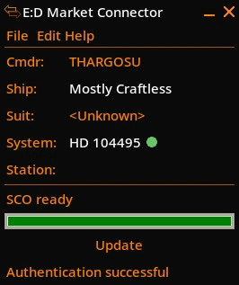
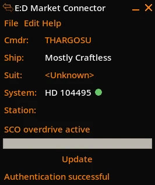
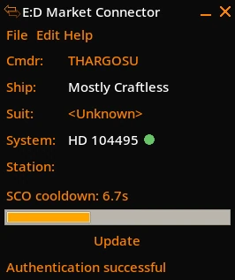

# SCO Cooldown EDMC plugin

This lightweight EDMC plugin watches the `Status.json` payload received through
EDMC's `dashboard_entry` callback and reads EDMC's existing journal state for
the active ship. It does not send journal or status data to any server.

When Supercruise Overdrive (SCO) changes from active to inactive, the plugin
starts a countdown. Its progress bar fills in orange while the drive cools down,
then turns green and plays the bundled `sco_ready.wav` alert when SCO is ready.

Before EDMC identifies a ship, the fallback duration is 9 seconds. Once it has,
the plugin automatically uses 17 seconds for legacy ships, 9 seconds for
new-generation ships, and 7 seconds for the Caspian Explorer. The settings page
can override the cooldown for the current `ShipID`, test the alert, and select a
custom local sound file; WAV is the most portable choice. SCO is detected from
`Flags2` bit 20 (`0x00100000`), as documented in [the Elite Dangerous Status File reference](https://elite-journal.readthedocs.io/en/latest/Status%20File.html).

The new-generation identifiers are `Python_NX`, `Type8`, `Mandalay`,
`CobraMkV`, `Corsair`, `PantherMkII`, `LakonMiner`, `SmallCombat01_NX`, and
`MediumTransport01`; the Caspian Explorer identifier is `Explorer_NX`. They are
based on [FDevIDs shipyard.csv](https://github.com/EDCD/FDevIDs/blob/master/shipyard.csv).

  

## FDev Issue Tracker reference

When this issue is fixed, this plugin will probably become useless:

https://issues.frontierstore.net/issue-detail/87980

## Installation

Please follow the updated instructions here:

https://github.com/EDCD/EDMarketConnector/wiki/Plugins
